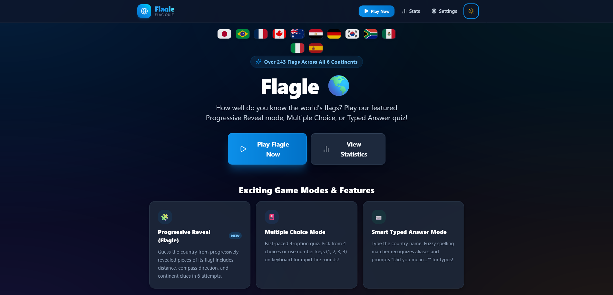

# Flagle 🌎

**Flagle** is a modern, responsive, 100% client-side web game where players guess world flags from progressively revealed pieces or test their knowledge across multiple quiz modes.

Built with **React**, **Vite**, and **Tailwind CSS**, Flagle requires **zero backend**, **zero API keys**, and is designed for seamless deployment to **GitHub Pages**.

<p align="center">
  <a href="https://github.allanrozario.com/Flagle/">
    
  </a>
</p>

---

## 🌟 Key Features

* **🧩 Flagle Progressive Reveal Mode**: Guess the secret world flag from progressively revealed pieces of a 6-tile grid! Make guesses to unlock more slices, with smart country autocomplete, geographic distance in kilometers, compass bearing arrows (e.g. `↗️ NE`), and continent clues.
* **🎴 Multiple Choice Mode**: Fast-paced quiz with 4 randomized answer options, real-time feedback, and keyboard shortcut support (`1`, `2`, `3`, `4`).
* **⌨️ Type the Country Mode**: Type the country name directly.
* **🧠 Smart Fuzzy Spelling Assistant**: If you mistype a country name (e.g. `Jpan` → Japan, `Untied States` → United States, `Frnace` → France), the game asks: *"Did you mean [Country]?"* Confirming counts as a correct answer with a spelling correction!
* **🌍 Full World Dataset (240+ Countries & Territories)**: Complete coverage of Africa, Asia, Europe, North America, South America, and Oceania with rich aliases (e.g., `USA`, `UK`, `UAE`, `Czech Republic`, `South Korea`, `Côte d'Ivoire`).
* **🗺️ Region & Continent Customization**: Practice the entire world or combine specific continents (e.g. Europe + Asia).
* **⏱️ Custom Game Lengths**: Choose between **10**, **20**, **50**, or **∞ Endless** questions.
* **🔥 Dynamic Streak System**: Visual flame badges, milestone sound effects, and confetti for hot streaks.
* **🔊 Web Audio API Sound Effects**: Zero external audio asset dependencies — pleasant synthesized chimes for correct answers, soft errors, streaks, and victory fanfare.
* **📊 Comprehensive Statistics Dashboard**: Persistent LocalStorage tracking total games, questions answered, overall accuracy, favorite game modes, continent breakdown bars, and frequently missed flags.
* **🌓 Dark & Light Mode**: Seamless theme toggling with glassmorphism visual styling.
* **📱 100% Mobile & Desktop Responsive**: Tested across mobile (320px–430px), tablet (768px), and desktop screen sizes with accessible touch targets.

---

## 🚀 Running Locally

Ensure you have **Node.js** (v18 or newer) installed.

1. **Clone the repository**:
   ```bash
   git clone https://github.com/AllanRoz/World-Flag-Quiz.git
   cd World-Flag-Quiz
   ```

2. **Install dependencies**:
   ```bash
   npm install
   ```

3. **Start the development server**:
   ```bash
   npm run dev
   ```

4. Open `http://localhost:3000` in your browser.

---

## 📦 Building for Production

To create a static production build:

```bash
npm run build
```

The optimized static assets will be output to the `dist/` directory.

You can preview the production build locally with:

```bash
npm run preview
```

---

## 🌐 Deploying to GitHub Pages

FlagGuess is pre-configured with `base: './'` in `vite.config.js` and `HashRouter` in `src/main.jsx`. This means it works out-of-the-box on GitHub Pages without 404 reload issues.

### Option 1: Automated GitHub Actions (Recommended)

A GitHub Actions workflow is already included in [`.github/workflows/deploy.yml`](.github/workflows/deploy.yml).

1. Push your code to GitHub on the `main` or `master` branch.
2. In your GitHub repository, go to **Settings** > **Pages**.
3. Under **Build and deployment** > **Source**, select **GitHub Actions**.
4. GitHub will automatically build and deploy your site on every push!

### Option 2: Deploy using `gh-pages` CLI

1. Run the deploy script:
   ```bash
   npm run deploy
   ```
2. In GitHub repository **Settings** > **Pages**, ensure the source is set to the `gh-pages` branch.

---

## 📂 Project Structure

```text
src/
├── components/
│   ├── common/
│   │   ├── Button.jsx          # Reusable button with sound & variants
│   │   ├── Card.jsx            # Glassmorphism container
│   │   ├── Modal.jsx           # Accessible dialog / modal
│   │   ├── Navbar.jsx          # Top navigation & theme toggle
│   │   └── StreakBadge.jsx     # Animated streak flame badge
│   ├── game/
│   │   ├── AnswerFeedback.jsx  # Question feedback banner & next button
│   │   ├── FlagCard.jsx        # Responsive flag display with spinner & fallback
│   │   ├── MultipleChoice.jsx  # 4-option keyboard accessible grid
│   │   ├── QuestionHeader.jsx  # Progress bar, question index, live scores
│   │   ├── SpellingModal.jsx   # "Did you mean...?" confirmation modal
│   │   └── TypedAnswer.jsx     # Text input with submit handling
│   └── results/
│       ├── ReviewGrid.jsx      # Filterable flag review list
│       └── ScoreCard.jsx       # Score percentage, rating, and metrics
├── data/
│   ├── continents.js           # Continent metadata, emojis, and colors
│   └── countries.js            # 240+ world countries, codes, capitals, aliases
├── pages/
│   ├── Game.jsx                # Active game engine & state
│   ├── GameSetup.jsx           # Mode, continent, and length config
│   ├── Home.jsx                # Landing page & hero
│   ├── Results.jsx             # Post-game celebration & review
│   ├── Settings.jsx            # Audio, theme, and data settings
│   └── Statistics.jsx          # Player history & accuracy dashboard
├── utils/
│   ├── confetti.js             # Canvas confetti celebrations
│   ├── countryMatching.js      # Damerau-Levenshtein fuzzy matching & normalization
│   ├── gameLogic.js            # Shuffling, queue generation, distractors
│   ├── sound.js                # Web Audio API sound synthesizer
│   └── storage.js              # LocalStorage statistics & preferences
├── App.jsx                     # Layout wrapper & routing
├── main.jsx                    # Application entry point with HashRouter
└── index.css                   # Tailwind CSS directives & custom mesh gradients
```

---

## 📄 License

MIT License — Feel free to use and customize for your own projects!
